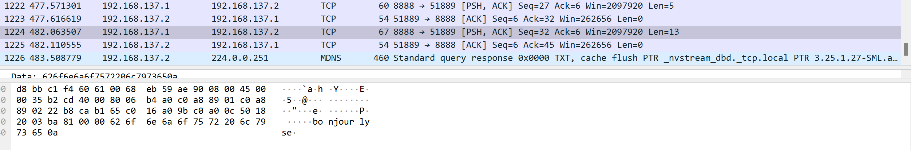

TP1-Premier pas réseau

I. Exploration locale en solo
Affichez les infos des cartes réseau de votre PC :
```
PS C:\Users\lebou> ipconfig /all
Carte réseau sans fil Wi-Fi :
    Suffixe DNS propre à la connexion. . . :
    Description. . . . . . . . . . . . . . : Realtek RTL8822BE 802.11ac PCIe Adapter
    Adresse physique . . . . . . . . . . . : 40-23-43-62-DB-DD
    DHCP activé. . . . . . . . . . . . . . : Oui
    Configuration automatique activée. . . : Oui
    Adresse IPv6 de liaison locale. . . . .: fe80::58a9:6a7d:966c:7195%20(préféré)
    Adresse IPv4. . . . . . . . . . . . . .: 10.33.17.26(préféré)
    Masque de sous-réseau. . . . . . . . . : 255.255.252.0
    Bail obtenu. . . . . . . . . . . . . . : lundi 3 octobre 2022 13:57:31
    Bail expirant. . . . . . . . . . . . . : mardi 4 octobre 2022 13:57:31
    Passerelle par défaut. . . . . . . . . : 10.33.19.254
    Serveur DHCP . . . . . . . . . . . . . : 10.33.19.254
    IAID DHCPv6 . . . . . . . . . . . : 138421059
    DUID de client DHCPv6. . . . . . . . : 00-01-00-01-25-4C-A0-73-00-68-EB-59-AE-90
    Serveurs DNS. . .  . . . . . . . . . . : 8.8.8.8
                                    8.8.4.4
                                    1.1.1.1
    NetBIOS sur Tcpip. . . . . . . . . . . : Activé
```
```
Carte Ethernet Ethernet :
   Statut du média. . . . . . . . . . . . : Média déconnecté
   Suffixe DNS propre à la connexion. . . :
   Description. . . . . . . . . . . . . . : Realtek Gaming GbE Family Controller
   Adresse physique . . . . . . . . . . . : 00-68-EB-59-AE-90
   DHCP activé. . . . . . . . . . . . . . : Oui
   Configuration automatique activée. . . : Oui
```

Affichez votre gateway : 
```
PS C:\Users\lebou> ipconfig
Carte réseau sans fil Wi-Fi :
   Suffixe DNS propre à la connexion. . . :
   Adresse IPv6 de liaison locale. . . . .: fe80::58a9:6a7d:966c:7195%20
   Adresse IPv4. . . . . . . . . . . . . .: 10.33.17.26
   Masque de sous-réseau. . . . . . . . . : 255.255.252.0
   Passerelle par défaut. . . . . . . . . : 10.33.19.254
```

Déterminer la MAC de la passerelle :
```
PS C:\Users\lebou> arp -a
Interface : 10.33.17.26 --- 0x14
Adresse Internet      Adresse physique      Type
10.33.19.254          00-c0-e7-e0-04-4e     dynamique
```

Trouvez comment afficher les informations sur une carte IP (change selon l'OS) :
```
Nom :	Wi-Fi
Adresse physique (MAC) :	40:23:43:62:db:dd
Adresse IPv4 :	10.33.17.26/22
Passerelle par défaut IPv4 :	10.33.19.254
```

2. Modifications des informations


Utilisez l'interface graphique de votre OS pour changer d'adresse IP : 

Panneau de configuration > Connexions réseau > Wi-Fi(WiFi@YNOV) > Propriétés > Protocole Internet version 4 > Utiliser l'adresse IP suivante.

Adresse IP : 10.33.17.27

Longueur de masque : 255.255.252.0


Expliquez pourquoi c'est possible de perdre son accès internet en faisant cette opération.

La première personne à posséder une adresse IP est "prioritaire".


II. Exploration locale en duo

1. Modification d'adresse IP


Modifiez l'IP des deux machines pour qu'elles soient dans le même réseau :

IP : 10.10.10.27
Longueur de masque : 255.255.255.0


Vérifier à l'aide d'une commande que votre IP a bien été changée :
```
PS C:\Users\lebou> ipconfig /all
IP : 10.10.10.27
```

Vérifier que les deux machines se joignent :
```
PS C:\Users\lebou> ping 10.10.10.77
Envoi d’une requête 'Ping'  10.10.10.77 avec 32 octets de données :
Réponse de 10.10.10.77 : octets=32 temps<1ms TTL=128
Réponse de 10.10.10.77 : octets=32 temps<1ms TTL=128
Réponse de 10.10.10.77 : octets=32 temps=1 ms TTL=128
Réponse de 10.10.10.77 : octets=32 temps<1ms TTL=128

Statistiques Ping pour 10.10.10.77:
    Paquets : envoyés = 4, reçus = 4, perdus = 0 (perte 0%),
Durée approximative des boucles en millisecondes :
    Minimum = 0ms, Maximum = 1ms, Moyenne = 0ms
```

Déterminer l'adresse MAC de votre correspondant :
```
PS C:\Users\lebou> arp -a
Interface : 10.10.10.27 --- 0x2
  Adresse Internet      Adresse physique      Type
  10.10.10.77           d8-bb-c1-f4-60-61     dynamique
```

1. Utilisation d'un des deux comme gateway
Tester l'accès internet :
```
PS C:\Users\lebou> ping 1.1.1.1
Envoi d’une requête 'Ping'  1.1.1.1 avec 32 octets de données :
    Réponse de 1.1.1.1 : octets=32 temps=26 ms TTL=55
    Réponse de 1.1.1.1 : octets=32 temps=65 ms TTL=55
    Réponse de 1.1.1.1 : octets=32 temps=25 ms TTL=55
    Réponse de 1.1.1.1 : octets=32 temps=85 ms TTL=55

    Statistiques Ping pour 1.1.1.1:
        Paquets : envoyés = 4, reçus = 4, perdus = 0 (perte 0%),
    Durée approximative des boucles en millisecondes :
        Minimum = 25ms, Maximum = 85ms, Moyenne = 50ms
```
```
PS C:\Users\lebou> ping 8.8.8.8
    Envoi d’une requête 'Ping'  8.8.8.8 avec 32 octets de données :
    Réponse de 8.8.8.8 : octets=32 temps=57 ms TTL=114
    Réponse de 8.8.8.8 : octets=32 temps=70 ms TTL=114
    Réponse de 8.8.8.8 : octets=32 temps=26 ms TTL=114
    Réponse de 8.8.8.8 : octets=32 temps=77 ms TTL=114

    Statistiques Ping pour 8.8.8.8:
        Paquets : envoyés = 4, reçus = 4, perdus = 0 (perte 0%),
    Durée approximative des boucles en millisecondes :
        Minimum = 26ms, Maximum = 77ms, Moyenne = 57ms
```
```   
PS C:\Users\lebou> ping google.com
    Envoi d’une requête 'ping' sur google.com [142.250.179.78] avec 32 octets de données :
    Réponse de 142.250.179.78 : octets=32 temps=82 ms TTL=114
    Réponse de 142.250.179.78 : octets=32 temps=73 ms TTL=114
    Réponse de 142.250.179.78 : octets=32 temps=66 ms TTL=114
    Réponse de 142.250.179.78 : octets=32 temps=110 ms TTL=114

    Statistiques Ping pour 142.250.179.78:
        Paquets : envoyés = 4, reçus = 4, perdus = 0 (perte 0%),
    Durée approximative des boucles en millisecondes :
        Minimum = 66ms, Maximum = 110ms, Moyenne = 82ms
```

Prouver que la connexion Internet passe bien par l'autre PC :
```
PS C:\Users\quentin> tracert -4 1.1.1.1
Détermination de l’itinéraire vers one.one.one.one [1.1.1.1]
avec un maximum de 30 sauts :

  1     3 ms     3 ms     2 ms  LAPTOP-R8S29PG0 [192.168.137.1]
  2     *        *        *     Délai d’attente de la demande dépassé.
  3    10 ms     8 ms     9 ms  10.33.19.254
  4     7 ms     6 ms     4 ms  137.149.196.77.rev.sfr.net [77.196.149.137]
  5    12 ms    11 ms    10 ms  108.97.30.212.rev.sfr.net [212.30.97.108]
  6    24 ms    25 ms    27 ms  222.172.136.77.rev.sfr.net [77.136.172.222]
  7    22 ms    23 ms    23 ms  77.136.172.221
  8    27 ms    24 ms    25 ms  221.10.136.77.rev.sfr.net [77.136.10.221]
  9    25 ms    26 ms    23 ms  221.10.136.77.rev.sfr.net [77.136.10.221]
 10    48 ms    26 ms    28 ms  141.101.67.254
 11    27 ms   114 ms    31 ms  172.71.128.2
 12    23 ms    23 ms    28 ms  one.one.one.one [1.1.1.1]
Itinéraire déterminé.
```

5. Petit chat privé
Sur le PC serveur : 
```
PS C:\Users\lebou\Documents\B1\Tp reseau\netcat-1.11> ./nc64.exe -l -p 8888
coucou
salut
ca va
```
Sur le PC client :
```
PS C:\Users\quentin\Desktop\netcat-1.11> .\nc.exe 10.33.17.26 8888
coucou
salut
ca va
```

Visualiser la connexion en cours :
```
PS C:\Windows\system32> netstat -a -n -b | Select-String 8888

  TCP    10.33.17.91:61170      10.33.17.26:8888       ESTABLISHED
```

Pour aller un peu plus loin :
```
PS C:\Users\lebou\Documents\B1\Tp reseau\netcat-1.11> ./nc64.exe -l -p 8888 -s 192.168.137.1
PS C:\WINDOWS\system32> netstat -a -n -b | Select-String 8888

  TCP    192.168.137.1:8888     0.0.0.0:0              LISTENING
```

6. Firewall
Activez et configurez votre firewall :
```
PS C:\Users\lebou\Documents\B1\Tp reseau\netcat-1.11> ./nc64.exe -l -p 8888
ccddggggccgr
ok,
dkdd
```

III. Manipulations d'autres outils/protocoles côté client

1. DHCP

Exploration du DHCP, depuis votre PC :
```
PS C:\Users\lebou\Documents\B1\Tp reseau\netcat-1.11> ipconfig /all
Carte réseau sans fil Wi-Fi :
   Bail expirant. . . . . . . . . . . . . : mercredi 5 octobre 2022 13:57:02
   Serveur DHCP . . . . . . . . . . . . . : 10.33.19.254
```

1. DNS

Trouver l'adresse IP du serveur DNS que connaît votre ordinateur :
```
PS C:\Users\lebou\Documents\B1\Tp reseau\netcat-1.11> ipconfig /all
Carte réseau sans fil Wi-Fi :
Serveurs DNS. . .  . . . . . . . . . . : 8.8.8.8
```

Utiliser, en ligne de commande l'outil nslookup (Windows, MacOS) ou dig (GNU/Linux, MacOS) pour faire des requêtes DNS à la main :

faites un lookup (lookup = "dis moi à quelle IP se trouve tel nom de domaine"):

- pour google.com

- pour ynov.com

Interpréter les résultats de ces commandes :
```
PS C:\Users\lebou> nslookup.exe
Serveur par dÚfaut :   dns.google
Address:  8.8.8.8

> google.com
Serveur :   dns.google
Address:  8.8.8.8

Réponse ne faisant pas autorité :
Nom :    google.com
Addresses:  2a00:1450:4007:807::200e
          142.250.179.78

> ynov.com
Serveur :   dns.google
Address:  8.8.8.8

Réponse ne faisant pas autorité :
Nom :    ynov.com
Addresses:  2606:4700:20::681a:be9
          2606:4700:20::681a:ae9
          2606:4700:20::ac43:4ae2
          172.67.74.226
          104.26.10.233
          104.26.11.233
```
Les résultats obtenus nous donne les adresses IP des serveurs DNS (pour ynov, il y a plusieurs adresse pour éviter d'être trop sur un même serveur et que le débit soit lent).


Déterminer l'adresse IP du serveur à qui vous venez d'effectuer ces requêtes :
```
PS C:\Users\lebou> nslookup.exe
Serveur par dÚfaut :   dns.google
Address:  8.8.8.8
```

Faites un reverse lookup (= "dis moi si tu connais un nom de domaine pour telle IP") :

- pour l'adresse 231.34.113.12

- pour l'adresse 78.34.2.17

Interpréter les résultats :
```
PS C:\Users\lebou> nslookup.exe
Serveur par dÚfaut :   dns.google
Address:  8.8.8.8

> 231.34.113.12
Serveur :   dns.google
Address:  8.8.8.8

*** dns.google ne parvient pas à trouver 231.34.113.12 : Non-existent domain
> 78.34.2.17
Serveur :   dns.google
Address:  8.8.8.8

Nom :    cable-78-34-2-17.nc.de
Address:  78.34.2.17
```
DNS ne le considère pas comme un nom de domaine, donc il ne le trouve pas.


IV. Wireshark

1. Intro Wireshark


Utilisez le pour observer les trames qui circulent entre vos deux carte Ethernet. Mettez en évidence :

Un ping entre vous et votre passerelle :
```
PS C:\Users\lebou\Documents\B1\Tp reseau\netcat-1.11> ping 8.8.8.8

Envoi d’une requête 'Ping'  8.8.8.8 avec 32 octets de données :
Réponse de 8.8.8.8 : octets=32 temps=42 ms TTL=114
Réponse de 8.8.8.8 : octets=32 temps=87 ms TTL=114
Réponse de 8.8.8.8 : octets=32 temps=96 ms TTL=114
Réponse de 8.8.8.8 : octets=32 temps=316 ms TTL=114

Statistiques Ping pour 8.8.8.8:
    Paquets : envoyés = 4, reçus = 4, perdus = 0 (perte 0%),
Durée approximative des boucles en millisecondes :
    Minimum = 42ms, Maximum = 316ms, Moyenne = 135ms
```


Un netcat entre vous et votre mate, branché en RJ45 :



Une requête DNS. Identifiez dans la capture le serveur DNS à qui vous posez la question :

